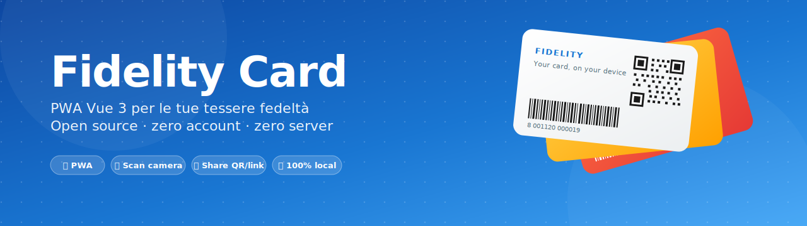

<p align="center">
  
</p>

# Fidelity Card

[](https://github.com/savez/fidality-card/actions/workflows/ci.yml)
[](https://fidality-card.onrender.com)
[](https://savez.github.io/fidality-card/)
[](LICENSE)
[](package.json)
[](https://github.com/savez/fidality-card/commits/main)
[](https://vuejs.org/)
[](https://web.dev/progressive-web-apps/)

PWA Vue 3 per salvare e condividere le proprie fidelity card (barcode / QR code) con la famiglia, senza backend custom.

🌐 **Pagina di progetto**: <https://savez.github.io/fidality-card/> (vetrina del repo — l'app vera è sulla demo Render qui sotto)

🚀 **Live demo**: <https://fidality-card.onrender.com>

> Quella è l'istanza di cortesia del maintainer. Per uso regolare, [forkala e fai il tuo deploy](#deploy-su-render) (5 minuti). Vedi la sezione [Free tier — uso responsabile](#️-free-tier--uso-responsabile) prima di usarla intensivamente.

## Funzionalità

- 📷 Scansione barcode / QR direttamente dalla fotocamera del telefono, con supporto a codici densi e deduzione automatica del formato
- ✍️ Inserimento manuale del codice
- 🏪 Libreria di brand italiani precostituita (Esselunga, Conad, Coop, IKEA, Q8, …) con icone e colori
- 🎨 Icona personalizzabile per card (emoji o nome icona Material Design)
- ⭐ Card pinnabili e ordinate automaticamente prima per pin e poi in ordine alfabetico
- 🔗 Condivisione card o vault via QR code, link e Web Share API (payload nel fragment URL, mai inviato a un server)
- 📥 Import card da QR / link condiviso
- 💾 Backup completo del DB in JSON (esportabile / re-importabile)
- 🌙 Tema salvato e ripristinato all'avvio
- 📱 Installabile come PWA con auto-update e offline completo
- 🌐 100% client-side: i dati restano sul tuo telefono in IndexedDB

## Tech stack

- **Frontend**: Vue 3 (Composition API, `<script setup>`) · Vite · Vuetify 3 · Pinia · vue-router (hash mode)
- **Storage**: IndexedDB via Dexie.js
- **Scan**: `@zxing/browser` + `@zxing/library`
- **QR / Barcode generation**: `qrcode` + `jsbarcode`
- **PWA**: `vite-plugin-pwa` (Workbox)
- **Test**: Vitest + `fake-indexeddb`
- **Linguaggio**: JavaScript puro (no TypeScript)
- **Lingua UI**: italiano
- **Deploy**: Render.com (static site, free tier)
- **Dev tooling**: ESLint + Prettier + Husky + lint-staged · `.vscode/` config condivise

## Setup locale

1. `nvm use` (Node 20)
2. `npm install`
3. `npm run dev` → http://localhost:5173/

## Deploy su Render

Render gestisce build + deploy in autonomia. **Non serve un workflow GitHub Actions per il deploy**: Render osserva il branch `main` via webhook nativo e lancia una nuova build ad ogni push.

### Prima volta (setup)

1. Crea un account su https://render.com (free, sufficiente per static sites)
2. Dashboard → "New +" → **"Blueprint"** (Render leggerà il `render.yaml` committato nel repo)
3. Connetti il tuo account GitHub e seleziona il repo `savez/fidality-card`
4. Conferma il nome del servizio (default: `fidality-card`)
5. Click **"Apply"** / **"Save & Deploy"** — il primo build parte automaticamente (~1-2 min)
6. Quando è online: copia l'URL (es. `https://fidality-card.onrender.com/`)

### Flusso continuativo

```
push su main → Render webhook → build → deploy
                     ↑
       (in parallelo, indipendente)
              ↓
        GitHub Action CI gira `npm test` + `npm run build`
        → mostra ✓/✗ sul commit (visibilità qualità)
```

I due flussi sono indipendenti: Render builda anche se il check CI fallisce. Se vuoi che il deploy parta solo a test passati, dovrai disabilitare auto-deploy in `render.yaml` (`autoDeploy: false`) e triggerare manualmente via Deploy Hook — non implementato in MVP.

### PR previews

Sono abilitate in `render.yaml` (`pullRequestPreviewsEnabled: true`). Ogni PR genera un URL temporaneo tipo `https://fidality-card-pr-5.onrender.com/`. Se ti danno fastidio, rimuovi quella riga dal `render.yaml`.

### ⚠️ Free tier — uso responsabile

Il servizio Render pubblico associato a questo repo (se attivo) gira sul **piano gratuito di Render**, che ha questi limiti per account:

- **100 GB bandwidth / mese**
- **Build minutes**: illimitati per static sites
- **Storage**: bundle ~2 MB
- **Concurrent users**: nessun limite hardware (è solo CDN per static)

Cosa significa per chi vuole usare l'app:

- ✅ **Forka e auto-hostati la TUA istanza** se prevedi uso regolare per te o la tua famiglia. Setup richiesto: 5 minuti (Render Blueprint + push). Niente env vars, niente account esterni. Render free tier è generoso per uso personale e supporterà la tua istanza senza problemi.
- 🚀 **La demo del maintainer è a [fidality-card.onrender.com](https://fidality-card.onrender.com)** — puoi provarla, ma è pensata per dare un'idea di cosa fa il progetto, non come servizio per migliaia di utenti.
- 🙏 **Non incorporare la demo del maintainer** in iframe, sistemi di terze parti, automazioni o test di carico. Esauriresti il free tier di un volontario.

In sintesi: **il codice è di tutti, l'hosting è uno solo**. Se ti piace il progetto, deploya il tuo fork — sarà sempre più affidabile della demo condivisa.

## 🔄 Service Worker & auto-update

L'app è una PWA: viene servita una volta, poi vive **offline** sul telefono dell'utente. Quando rilasci una nuova versione, come fa l'app già installata ad accorgersene?

### Cosa genera il build

Il plugin [`vite-plugin-pwa`](https://vite-pwa-org.netlify.app/) emette al build (`dist/`):

- **`sw.js`** — il Service Worker (script che gira in background nel browser)
- **`manifest.webmanifest`** — descrittore PWA (nome, icone, theme color)
- **`registerSW.js`** — bootstrap che registra il SW al primo load
- **asset con hash nel nome** (`index-Co0vq0PP.js`, ecc.) — il fingerprint nel nome È la versione del singolo file

Il punto chiave: `sw.js` contiene una **lista precachable** di tutti gli asset dell'app:

```js
// estratto semplificato di sw.js
const precache = [
  { url: 'index.html', revision: 'abc123' },
  { url: 'assets/index-Co0vq0PP.js', revision: null }, // hash nel nome
  { url: 'assets/CardEditView-C4lCWry2.js', revision: null },
  // ... ~30 entries
]
```

In più, dalla nostra config:

```js
cacheId: `fidality-card-v${pkg.version}`,    // cache namespaced per release
cleanupOutdatedCaches: true,                  // vecchie cache rimosse all'attivazione
```

→ ogni release ha la sua "famiglia" di cache (`fidality-card-v1.0.0-*`, `fidality-card-v1.1.0-*`). Visibile in DevTools → Application → Cache Storage.

### Il flusso di update step by step

```
   Tu fai release                Browser dell'utente
─────────────────────         ────────────────────────

build → nuovo sw.js
push main → Render
                          →    L'utente apre la PWA
                               ↓
                               Browser fetch /sw.js
                               ↓
                               Confronto byte vs SW installato
                               ↓
                          Diverso? → Installa il nuovo SW in stato "waiting"
                               ↓
                               Callback `onNeedRefresh` parte
                               ↓
                               needRefresh.value = true (Vue reactive)
                               ↓
                               v-snackbar appare: "Nuova versione disponibile"
                               ↓
                               User → click "Ricarica"
                               ↓
                               updateSW(true) → skipWaiting + reload
                               ↓
                               Vecchio SW disattivato, vecchie cache eliminate
                               ↓
                               Nuovi asset attivi, versione bumpata visibile in Settings
```

### `registerType: 'prompt'` vs `'autoUpdate'`

| Modalità               | Comportamento                                                                                                            |
| ---------------------- | ------------------------------------------------------------------------------------------------------------------------ |
| `'autoUpdate'`         | Il nuovo SW prende il controllo da solo, reload silenzioso. UX trasparente ma può sembrare che "le cose cambino da sole" |
| `'prompt'` (la nostra) | Espone un callback `onNeedRefresh` → l'utente decide quando ricaricare via snackbar                                      |

Abbiamo scelto `'prompt'` perché:

- L'utente potrebbe essere a metà di una transazione (es. card mezzo compilata)
- Un reload silenzioso interromperebbe il lavoro
- È più trasparente: l'utente sa che c'è qualcosa di nuovo

### File coinvolti

| File                              | Ruolo                                                                           |
| --------------------------------- | ------------------------------------------------------------------------------- |
| `vite.config.js`                  | Configura `VitePWA` plugin (manifest, workbox, cacheId versionato)              |
| `src/composables/usePwaUpdate.js` | Cattura i callback `onNeedRefresh` / `onOfflineReady` da `virtual:pwa-register` |
| `src/main.js`                     | Chiama `initPwa()` al boot                                                      |
| `src/App.vue`                     | Mostra il `v-snackbar` con bottoni "Ricarica" / "Dopo"                          |

### Vedere la versione corrente

In **Impostazioni** è visualizzato `Fidelity Card · vX.Y.Z` in fondo alla pagina. Il valore proviene da `package.json` via `import.meta.env`-like injection (`define: __APP_VERSION__` in `vite.config.js`). release-please bumpa `package.json`, il prossimo build legge il nuovo valore.

### Gotcha

- **dev mode**: il SW NON è attivo in `npm run dev` di default — per testarlo serve `npm run build && npm run preview`
- **HTTPS obbligatorio**: i SW funzionano solo su `https://` o `localhost`. Su rete locale (es. `192.168.x.x`) il SW non si registra
- **iOS Safari**: supporto PWA più limitato — niente install prompt automatico, l'utente deve fare "Aggiungi a Home" manualmente
- **Cache aggressiva**: in caso di bug post-release, l'utente potrebbe vedere la vecchia versione finché lo snackbar non gli ricarica. Tieni d'occhio le PR di rollback urgenti

## CI / GitHub Actions

Il workflow `.github/workflows/ci.yml` parte automaticamente:

- Ad ogni push su `main`
- Ad ogni PR verso `main`

Cosa fa:

- `npm ci` — install riproducibile
- `npm test` — esegue i 22 test Vitest
- `npm run build` — verifica che la build produca artefatti validi

Output visibile nella tab **Actions** del repo GitHub e come check sui commit / PR.

## 🏷️ Release automation

Il progetto usa [**release-please**](https://github.com/googleapis/release-please) (di Google) per automatizzare versionamento, CHANGELOG e GitHub Releases. **Nessun PAT o GitHub App** richiesti: tutto funziona con il `GITHUB_TOKEN` integrato di GitHub Actions.

### Per i contributor: cosa serve sapere

**Una sola regola**: scrivi i commit message in formato [Conventional Commits](https://www.conventionalcommits.org/). La pipeline fa il resto.

```bash
git commit -m "feat(brands): aggiungi Tigotà alla lista"
git commit -m "fix(scan): risolvi crash su QR con caratteri speciali"
git commit -m "docs: chiarisci setup Render nel README"
```

Se sbagli formato (es. `commit -m "aggiungo Tigotà"`), **il commit viene rifiutato**:

- localmente dall'hook Husky `commit-msg` (commitlint)
- in CI dal workflow `commitlint.yml` (re-valida sui PR aperti da fork)

I contributor **non devono mai toccare a mano**: `package.json` version, `CHANGELOG.md`, tag git, GitHub Releases. Tutto generato automaticamente.

### Sistema a 2 gate (per il maintainer)

```
┌──────────────────────────────────────────────────────────────────┐
│ GATE 1 — Feature PR                                              │
│                                                                  │
│ Contributor → fork → branch → conventional commits → PR          │
│                ▼                                                 │
│  CI gira: ✓ test  ✓ build  ✓ lint  ✓ commit format               │
│                ▼                                                 │
│  Maintainer mergia la PR su `main`                               │
└──────────────────────────────────────────────────────────────────┘
                     │
                     ▼
            release-please action gira automaticamente
                     │
                     ▼
┌──────────────────────────────────────────────────────────────────┐
│ GATE 2 — Release PR (auto-mantenuta)                             │
│                                                                  │
│ release-please apre (o aggiorna se esiste già) una PR titolata   │
│ "chore(main): release vX.Y.Z" che contiene:                      │
│                                                                  │
│   • bump in package.json (es. 1.0.0 → 1.1.0)                     │
│   • CHANGELOG.md aggiornato con sezioni dai commit               │
│   • bump in .release-please-manifest.json                        │
│                                                                  │
│ Questa PR accumula tutte le feature/fix mergiate da quando       │
│ l'ultima release è stata pubblicata.                             │
│                                                                  │
│ Maintainer mergia la Release PR quando vuole pubblicare          │
│ (subito dopo ogni feature, o accumulando — a sua scelta)         │
└──────────────────────────────────────────────────────────────────┘
                     │
                     ▼
      release-please crea il tag vX.Y.Z e la GitHub Release
      con note generate dai conventional commits
```

### Domande frequenti

**È completamente automatico per i contributor?**

Sì. Loro fanno solo PR con commit ben scritti. Niente CHANGELOG da modificare, niente tag, niente versioni. Il maintainer ha 2 momenti dove clicca "Merge" (feature PR e Release PR).

**Parte tutto al merge su main?**

Sì, ma la **Release PR è solo preparata, non pubblicata**. La release vera (tag + GitHub Release) parte solo quando il maintainer mergia la Release PR. Questo permette di scegliere il timing: release continua (mergi la Release PR appena appare) oppure cumulativa (accumuli più feature prima).

**Come decide la prossima versione?**

Legge i conventional commits accumulati dall'ultimo tag e applica le regole [SemVer](https://semver.org/):

| Prefisso commit                              | Sezione CHANGELOG              | Bump versione             |
| -------------------------------------------- | ------------------------------ | ------------------------- |
| `feat:` o `feat(scope):`                     | ✨ Features                    | **minor** (1.0.0 → 1.1.0) |
| `fix:` o `fix(scope):`                       | 🐛 Bug Fixes                   | **patch** (1.0.0 → 1.0.1) |
| `perf:`                                      | ⚡ Performance                 | patch                     |
| `refactor:`                                  | ♻️ Refactoring                 | patch                     |
| `docs:`                                      | 📝 Documentation               | nessuno                   |
| `feat!:` o footer `BREAKING CHANGE:`         | (categoria sopra, evidenziato) | **major** (1.0.0 → 2.0.0) |
| `chore:`, `test:`, `ci:`, `build:`, `style:` | (nascosti dal CHANGELOG)       | nessuno                   |

**Cosa succede se mergio una PR con solo `chore:` o `docs:`?**

Nessuna Release PR viene aperta (perché niente di rilevante per gli utenti). Quei commit appariranno comunque nella prossima release insieme alla prima `feat:` o `fix:` mergiata.

**Posso forzare una release manualmente?**

Sì: Actions → release-please → "Run workflow" (workflow_dispatch). Oppure aggiungi un commit con footer `Release-As: 1.2.3` per forzare una versione specifica (vedi docs release-please).

**Cosa vede chi visita il repo?**

- `CHANGELOG.md` aggiornato a ogni release (committato su `main`)
- Tab **Releases** su GitHub con note dettagliate per ogni versione
- Badge "Version" nel README aggiornato a ogni release
- Tag `v1.0.0`, `v1.1.0`, ecc. (formato standard SemVer con prefisso `v`)

### File di configurazione

| File                                   | Cosa contiene                                 |
| -------------------------------------- | --------------------------------------------- |
| `release-please-config.json`           | Sezioni del CHANGELOG, regole di bump         |
| `.release-please-manifest.json`        | Versione corrente (auto-aggiornata)           |
| `commitlint.config.js`                 | Regole di validazione commit message          |
| `.github/workflows/release-please.yml` | Action che gira al push su `main`             |
| `.github/workflows/commitlint.yml`     | Validazione commit nei PR (anche da fork)     |
| `.husky/commit-msg`                    | Validazione commit localmente, prima del push |

## Script

| Comando                | Cosa fa                                             |
| ---------------------- | --------------------------------------------------- |
| `npm run dev`          | Dev server su http://localhost:5173/ con HMR        |
| `npm run build`        | Build produzione → output in `dist/`                |
| `npm run preview`      | Serve il `dist/` localmente per verificare la build |
| `npm test`             | Esegue la suite Vitest (22 test)                    |
| `npm run test:watch`   | Vitest in modalità watch                            |
| `npm run lint`         | ESLint sui file JS/Vue                              |
| `npm run lint:fix`     | ESLint + auto-fix                                   |
| `npm run format`       | Prettier sull'intero repo                           |
| `npm run format:check` | Verifica formattazione senza modificare             |

## Struttura progetto

```
src/
├── main.js                  # entry point Vue
├── App.vue                  # shell app (nav bar, bottom nav, banner errori)
├── router.js                # hash routing
├── stores/
│   └── cards.js             # Pinia: lista card reattiva + CRUD
├── db/
│   ├── index.js             # Dexie schema + probeDb
│   └── cards.js             # CRUD card
├── brands/
│   ├── brands.js            # libreria 20 brand italiani
│   └── BrandPicker.vue      # select brand + "Altro"
├── scan/
│   └── BarcodeScanner.vue   # camera + ZXing, timeout 20s
├── share/
│   ├── payload.js           # encode/decode payload base64url
│   └── ShareDialog.vue      # dialog QR + link
├── components/
│   ├── CardTile.vue         # tile della griglia
│   ├── BarcodeDisplay.vue   # render barcode 1D / QR / DataMatrix
│   └── IconaDisplay.vue     # render emoji o icona mdi-*
├── views/
│   ├── CardsView.vue        # lista + ricerca + filtro brand
│   ├── CardEditView.vue     # nuova / modifica
│   ├── CardDetailView.vue   # dettaglio + barcode grande + azioni
│   ├── ImportView.vue       # import da link condiviso
│   └── SettingsView.vue     # backup
├── composables/
│   ├── usePwaUpdate.js      # prompt "nuova versione disponibile"
│   ├── useTheme.js          # tema chiaro / scuro / sistema
│   └── useDbStatus.js       # stato apertura IndexedDB
└── plugins/
    └── vuetify.js           # tema + defaults Vuetify

tests/
├── setup.js                 # fake-indexeddb + crypto polyfill
├── brands.spec.js           # 6 test
├── payload.spec.js          # 9 test
└── db.spec.js               # 8 test
```

## Installazione come app (PWA)

- **Android (Chrome)**: menu (⋮) → "Installa app" — l'icona compare in home, l'app gira a schermo intero
- **iOS (Safari)**: condividi (□↑) → "Aggiungi a Home"
- **Desktop (Chrome / Edge)**: icona di installazione nella barra degli indirizzi

Una volta installata, l'app funziona completamente offline.

## Privacy & dati

- I dati delle card stanno **solo** nel tuo browser (IndexedDB)
- Nessun login, nessun account, nessun server custom: l'app non invia mai i tuoi dati da nessuna parte
- La condivisione card è un trasferimento one-shot: il destinatario salva una copia indipendente nel suo IndexedDB
- Il backup JSON è esportato in locale (download del file) — nessun upload su server
- Chi installa la PWA sul proprio device ha il SUO database isolato (non vede card di altri device)

## Troubleshooting

**Scanner non parte sul telefono in dev**
La fotocamera richiede HTTPS. `http://192.168.x.x:5173` non basta. O fai il deploy su Render e provi lì, o usa una tunnel HTTPS come `ngrok http 5173`.

**"Database locale non disponibile" banner**
IndexedDB non funziona (es. modalità in incognito su Firefox, browser molto vecchio, storage pieno). Esci dall'incognito o libera spazio.

**Render non aggiorna l'app dopo un push**
Verifica nel dashboard Render → tab "Events" che il deploy sia partito. Se è in "Failed", clicca per vedere il log del build. Se non è proprio partito, controlla in Settings del servizio che "Auto-Deploy" sia "Yes" e che il branch monitorato sia `main`.

## Documenti di progetto

- [Specifiche iniziali](specifiche-iniziali.md) — requisiti raccolti prima del brainstorming

Le specifiche tecniche dettagliate e il piano di implementazione sono mantenuti localmente dal maintainer (cartella `docs/`, gitignored). L'architettura completa è desumibile dal codice ben strutturato e dalle sezioni di questo README.

## Roadmap futura (non in MVP)

- [ ] 🤖 Riconoscimento brand automatico via foto (AI vision)
- [ ] 🔒 Cifratura DB locale (passphrase)
- [ ] 🔄 Sync multi-device opzionale
- [ ] 👥 Condivisione persistente con gruppi famiglia
- [ ] 🌍 Aggiungere brand di altri paesi alla libreria
- [ ] 📝 Traduzioni UI (i18n)

## License & Contributing

Questo progetto è rilasciato sotto licenza **MIT** — vedi [LICENSE](LICENSE).

In pratica: chiunque può forkare, modificare, ridistribuire (anche commercialmente), purché mantenga la nota di copyright.

**Vuoi contribuire?** Leggi [CONTRIBUTING.md](CONTRIBUTING.md): troverai come settare l'ambiente di sviluppo, le convenzioni di branch / commit, e come aprire una PR.

**Vuoi solo usare l'app per te?** Forka il repo, deploya su Render (o dove preferisci). Setup è banale: `npm install && npm run build` — nessuna configurazione, nessun env var. Vedi la sezione **Deploy su Render** sopra.

## 💬 Support

- 🐛 **Bug o feature request** → [apri una issue](https://github.com/savez/fidality-card/issues/new)
- 💡 **Idee, domande, discussioni** → [GitHub Discussions](https://github.com/savez/fidality-card/discussions) (se abilitate) o issue con label `question`
- 🔧 **Vuoi contribuire?** → [CONTRIBUTING.md](CONTRIBUTING.md)

---

Built with ❤️ per gestire fidelity card senza app spazzatura.
